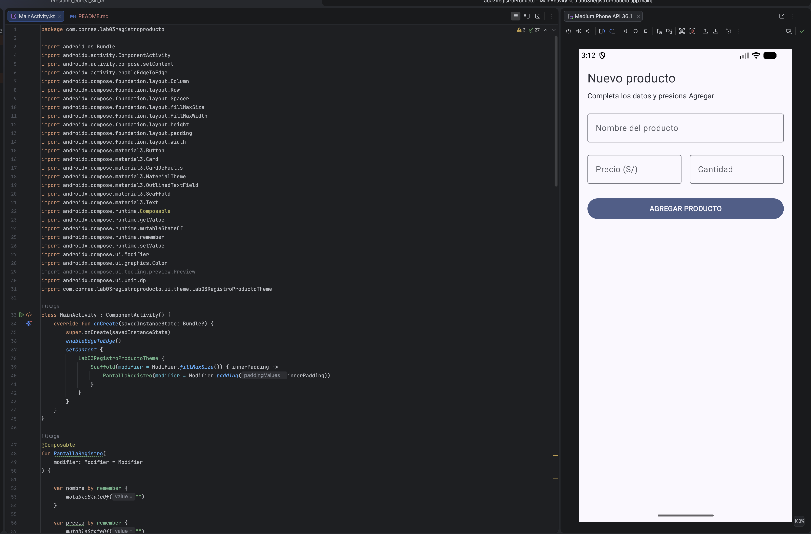
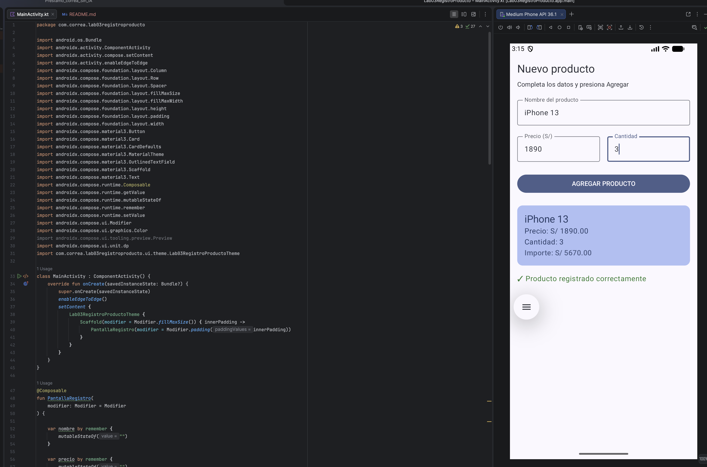

# Lab03RegistroProducto

## Datos del estudiante

**Nombre:** Fernando Luis Correa Huincho

## Descripción

Aplicación desarrollada con Jetpack Compose para registrar un producto.

La aplicación permite ingresar:

- Nombre del producto
- Precio
- Cantidad

## Captura de pantalla inicial

## Producto registrado

## ¿Qué pasaría si declaro las variables de los campos SIN remember?

"remember" permite conservar el estado de los valores mientras Compose recompone la interfaz. Si no utilizáramos remember, la información se mostraría en la interfaz gráfica del móvil; sin embargo, al cambiar la orientación del dispositivo, dicha información se perdería.

## Mejora con IA

| Prompt que usé | Qué generó Gemini | Qué acepté o corregí (y por qué) |
|---|---|---|
| Agrega validación de campos vacíos en PantallaRegistro y un botón Limpiar. Si falta un dato al presionar AGREGAR PRODUCTO, muestra un mensaje de error en rojo en lugar de la Card. No cambies el resto de la interfaz. | Generó la validación de campos vacíos, el estado para el mensaje de error y el botón Limpiar. | Acepté la estructura general. Después corregí la validación para comprobar también que precio y cantidad fueran valores numéricos válidos y evitar valores negativos. |

### Mejora adicional: conservación del estado

Se reemplazó `remember` por `rememberSaveable` en los estados del
formulario para conservar los valores cuando cambia la configuración
de la pantalla, como al girar el dispositivo.