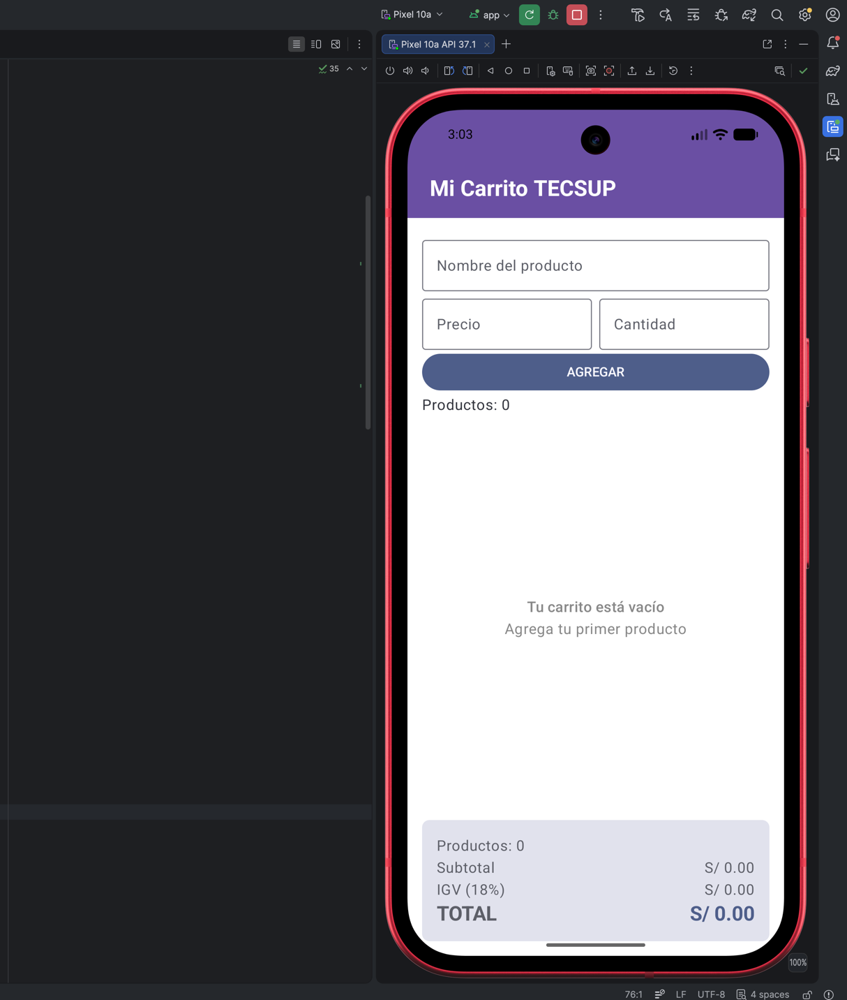
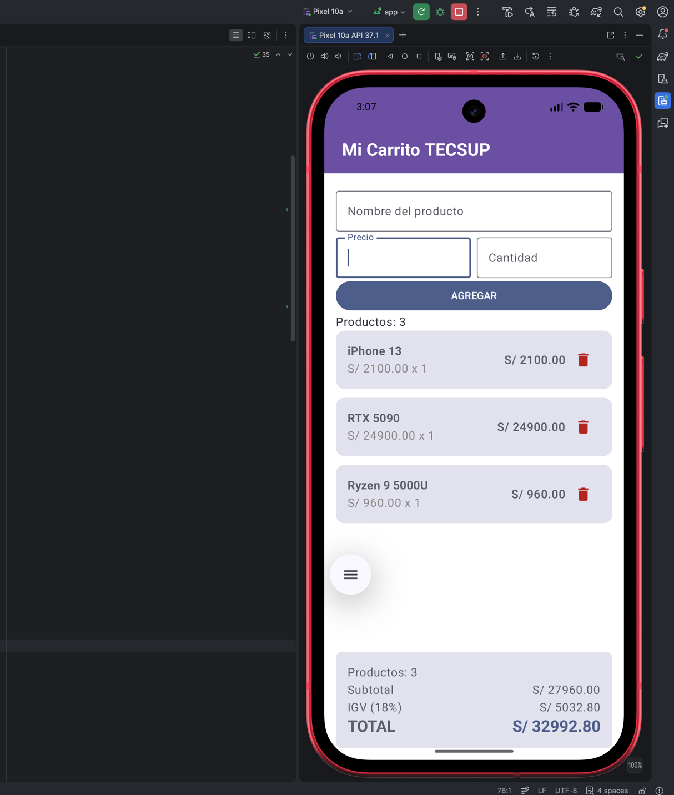

# Mi Carrito TECSUP

Lester Correa — 4to Ciclo, Programación en Móviles

Aplicación de carrito de compras en Jetpack Compose que integra modelo de datos,
formulario y lista dinámica con LazyColumn.

## Capturas

## Respuestas conceptuales

**¿Por qué mutableStateListOf y no una MutableList normal?**
Porque mutableStateListOf crea una lista observable por Compose. Cuando agregamos o
eliminamos un elemento, Compose detecta el cambio y redibuja la LazyColumn
automáticamente. Una MutableList normal no está conectada al sistema de estado,
así que Compose no se entera del cambio y la interfaz grafica no se actualiza. 

**¿Por qué la lista es val?**
val fija la referencia a la lista, no su contenido. Podemos seguir mutando ese
mismo objeto con add o remove. solo no podríamos reasignar productos a otra
lista distinta.

**¿Qué hace weight(1f) en la LazyColumn?**
Hace que la LazyColumn ocupe todo el espacio vertical disponible que sobra
después del formulario, dejando el panel de totales siempre visible y fijo
en la parte inferior.