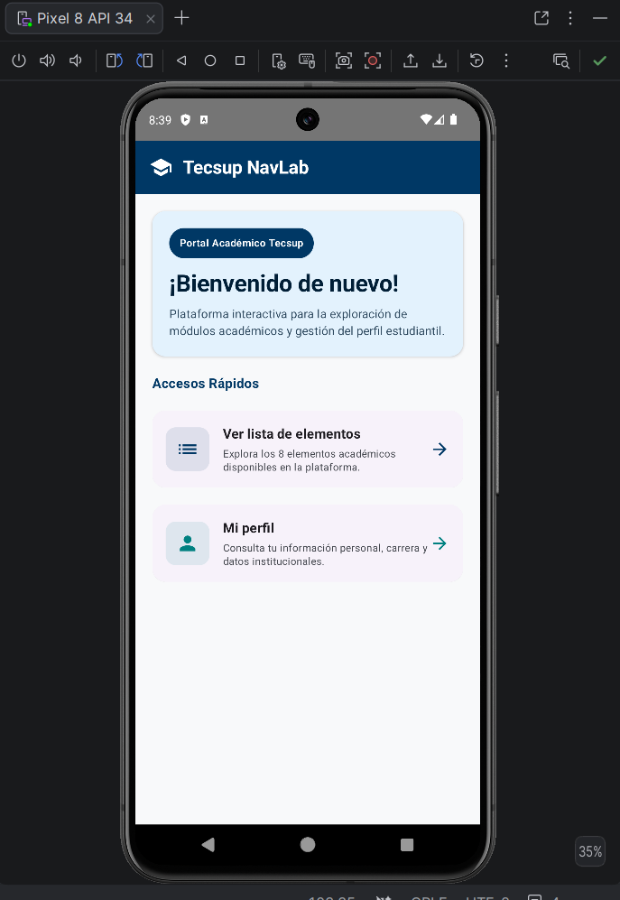
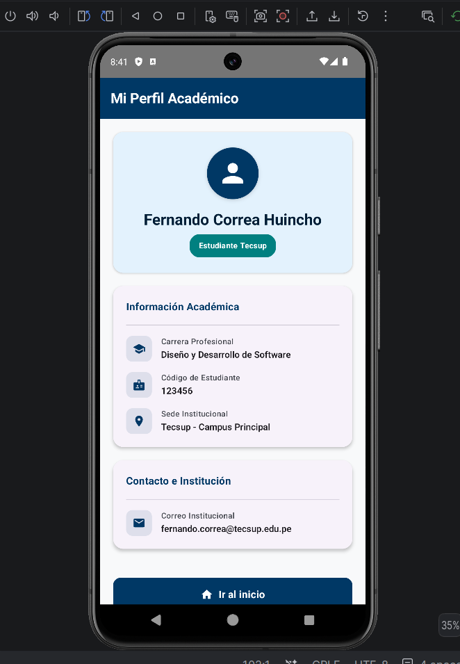
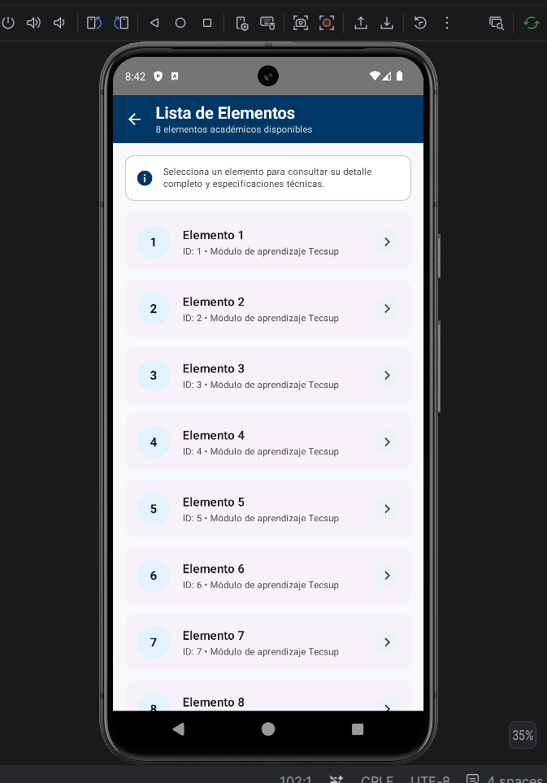

# Prompt utilizado para mejorar el aspecto visual del proyecto

Estoy desarrollando una aplicación Android llamada **NavLab** utilizando **Kotlin**, **Jetpack Compose** y **Material 3**.

La aplicación actualmente implementa navegación entre cuatro pantallas:

1. `HomeScreen`
2. `ListScreen`
3. `DetailScreen`
4. `ProfileScreen`

La navegación ya funciona mediante **Navigation Compose** utilizando:

- `NavController`
- `NavHost`
- `sealed class Screen`
- Rutas:
    - `home`
    - `list`
    - `profile`
    - `detail/{itemId}`
- Argumentos mediante `NavType.IntType`

> **IMPORTANTE:** No debes modificar ni eliminar la lógica de navegación existente.

Quiero mejorar **únicamente la presentación visual** de la aplicación para que tenga una apariencia **moderna, profesional y coherente con una aplicación académica de Tecsup**.

---

## Requisitos de diseño

La interfaz debe cumplir con los siguientes criterios:

- Utilizar **Jetpack Compose** y **Material 3**.
- Mantener una interfaz limpia, moderna y profesional.
- Utilizar una jerarquía visual clara.
- Mejorar los tamaños y estilos de títulos y textos.
- Utilizar `Card` y superficies para agrupar información.
- Utilizar iconos de Material cuando sean apropiados.
- Mejorar el espaciado, márgenes y distribución de los componentes.
- Utilizar botones visualmente consistentes.
- Mantener una navegación intuitiva.
- Mantener compatibilidad con diferentes tamaños de pantalla.
- Evitar una interfaz sobrecargada.
- Mantener una apariencia relacionada con un **portal académico**.
- Utilizar una paleta de colores profesional y consistente.
- Mantener una accesibilidad básica:
    - Buen contraste.
    - Textos legibles.
    - Descripciones adecuadas para los iconos.

---

## Pantalla de inicio

Actualmente contiene:

- Título: **"Pantalla Tecsup"**
- Botón: **"Ver lista de elementos"**
- Botón: **"Mi perfil"**

Mejorar esta pantalla para que funcione como una **pantalla de bienvenida académica**.

Puede incorporar:

- Encabezado visual.
- Título principal.
- Texto descriptivo breve.
- Una sección de acceso rápido.
- `Cards` o botones visualmente atractivos para acceder a la lista y al perfil.

---

## Pantalla de lista

Actualmente muestra **8 elementos** utilizando `LazyColumn`.

Mejorar su presentación mediante:

- `TopAppBar` moderna.
- Elementos visualmente diferenciados.
- Iconos apropiados.
- Información secundaria.
- Separación visual clara.
- Indicadores de que cada elemento puede seleccionarse.

> La navegación hacia `DetailScreen` debe mantenerse **exactamente igual**.

---

## Pantalla de detalle

Actualmente recibe:

```kotlin
itemId: Int
```


## Capturas de Funcionamiento






